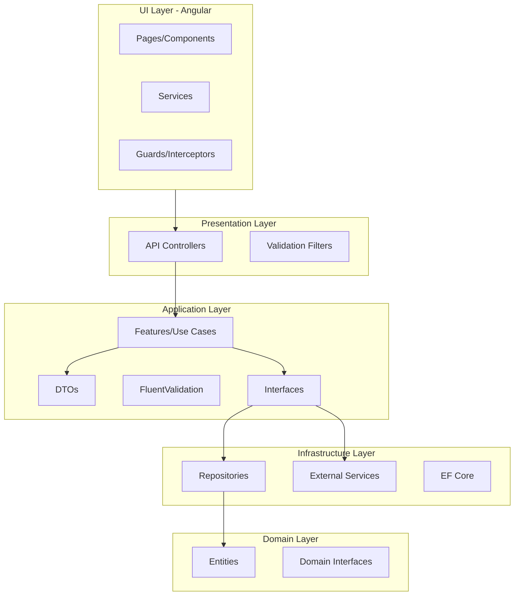
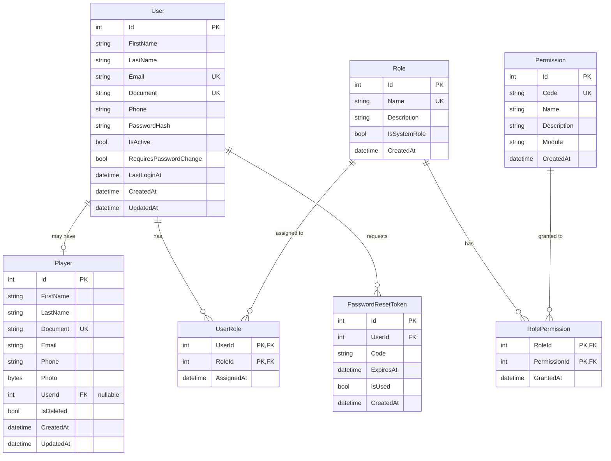
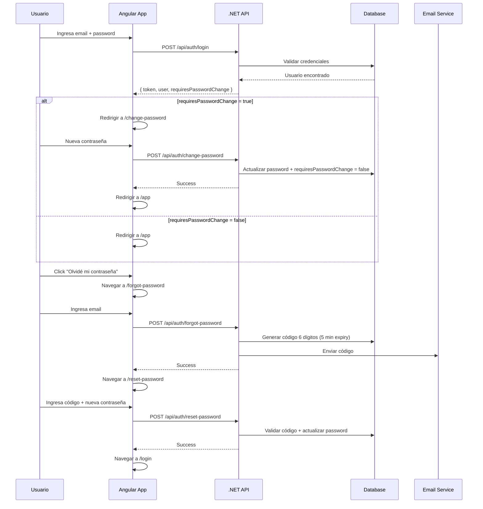

# Plan de Implementación - Fase 1: Autenticación

## Resumen Ejecutivo

Este plan detalla la implementación completa de la **Fase 1: Autenticación** para la aplicación de Torneos de Pádel. Incluye login, registro de usuarios (solo admin), cambio de contraseña obligatorio, recuperación de contraseña por código numérico, perfil de usuario, y sistema completo de roles y permisos configurables desde base de datos.

---

## Arquitectura del Sistema



---

## Modelo de Datos

### Diagrama Entidad-Relación



---

## Mapa de Archivos a Crear/Modificar

### Backend (.NET)

#### 1. Core.Domain - Entities

| Archivo | Acción | Ubicación | Justificación |
|---------|--------|-----------|---------------|
| [User.cs](file:///c:/Users/Jose%20Daniel%20Molina/Desktop/SolutionBase/src/Core/Core.Domain/Entities/User.cs) | MODIFY | `Core.Domain/Entities/` | Agregar campos: Document, Phone, RequiresPasswordChange. Implementar factory methods y constructor privado |
| [Player.cs](file:///c:/Users/Jose%20Daniel%20Molina/Desktop/SolutionBase/src/Core/Core.Domain/Entities/Player.cs) | NEW | `Core.Domain/Entities/` | Entidad separada para jugadores con relación opcional a User |
| [Role.cs](file:///c:/Users/Jose%20Daniel%20Molina/Desktop/SolutionBase/src/Core/Core.Domain/Entities/Role.cs) | NEW | `Core.Domain/Entities/` | Roles del sistema (AdminPlataforma, Organizador, AdminEvento) |
| [Permission.cs](file:///c:/Users/Jose%20Daniel%20Molina/Desktop/SolutionBase/src/Core/Core.Domain/Entities/Permission.cs) | NEW | `Core.Domain/Entities/` | Permisos individuales por acción |
| [UserRole.cs](file:///c:/Users/Jose%20Daniel%20Molina/Desktop/SolutionBase/src/Core/Core.Domain/Entities/UserRole.cs) | NEW | `Core.Domain/Entities/` | Tabla intermedia Usuario-Rol |
| [RolePermission.cs](file:///c:/Users/Jose%20Daniel%20Molina/Desktop/SolutionBase/src/Core/Core.Domain/Entities/RolePermission.cs) | NEW | `Core.Domain/Entities/` | Tabla intermedia Rol-Permiso |
| [PasswordResetToken.cs](file:///c:/Users/Jose%20Daniel%20Molina/Desktop/SolutionBase/src/Core/Core.Domain/Entities/PasswordResetToken.cs) | NEW | `Core.Domain/Entities/` | Tokens de recuperación de contraseña |

---

#### 2. Core.Domain - Interfaces/Repositories

| Archivo | Acción | Ubicación | Justificación |
|---------|--------|-----------|---------------|
| [IUserRepository.cs](file:///c:/Users/Jose%20Daniel%20Molina/Desktop/SolutionBase/src/Core/Core.Domain/Interfaces/Repositories/IUserRepository.cs) | MODIFY | `Core.Domain/Interfaces/Repositories/` | Agregar métodos: GetByDocumentAsync, GetWithRolesAsync |
| [IPlayerRepository.cs](file:///c:/Users/Jose%20Daniel%20Molina/Desktop/SolutionBase/src/Core/Core.Domain/Interfaces/Repositories/IPlayerRepository.cs) | NEW | `Core.Domain/Interfaces/Repositories/` | Repositorio para jugadores |
| [IRoleRepository.cs](file:///c:/Users/Jose%20Daniel%20Molina/Desktop/SolutionBase/src/Core/Core.Domain/Interfaces/Repositories/IRoleRepository.cs) | NEW | `Core.Domain/Interfaces/Repositories/` | Repositorio para roles |
| [IPermissionRepository.cs](file:///c:/Users/Jose%20Daniel%20Molina/Desktop/SolutionBase/src/Core/Core.Domain/Interfaces/Repositories/IPermissionRepository.cs) | NEW | `Core.Domain/Interfaces/Repositories/` | Repositorio para permisos |
| [IPasswordResetTokenRepository.cs](file:///c:/Users/Jose%20Daniel%20Molina/Desktop/SolutionBase/src/Core/Core.Domain/Interfaces/Repositories/IPasswordResetTokenRepository.cs) | NEW | `Core.Domain/Interfaces/Repositories/` | Repositorio para tokens de reset |

---

#### 3. Infrastructure.Persistence - Configurations

| Archivo | Acción | Ubicación | Justificación |
|---------|--------|-----------|---------------|
| [UserConfiguration.cs](file:///c:/Users/Jose%20Daniel%20Molina/Desktop/SolutionBase/src/Infrastructure/Infrastructure.Persistence/Configurations/UserConfiguration.cs) | MODIFY | `Infrastructure.Persistence/Configurations/` | Agregar nuevos campos y relaciones |
| [PlayerConfiguration.cs](file:///c:/Users/Jose%20Daniel%20Molina/Desktop/SolutionBase/src/Infrastructure/Infrastructure.Persistence/Configurations/PlayerConfiguration.cs) | NEW | `Infrastructure.Persistence/Configurations/` | Configuración EF para Player |
| [RoleConfiguration.cs](file:///c:/Users/Jose%20Daniel%20Molina/Desktop/SolutionBase/src/Infrastructure/Infrastructure.Persistence/Configurations/RoleConfiguration.cs) | NEW | `Infrastructure.Persistence/Configurations/` | Configuración EF para Role + seed data |
| [PermissionConfiguration.cs](file:///c:/Users/Jose%20Daniel%20Molina/Desktop/SolutionBase/src/Infrastructure/Infrastructure.Persistence/Configurations/PermissionConfiguration.cs) | NEW | `Infrastructure.Persistence/Configurations/` | Configuración EF para Permission + seed data |
| [UserRoleConfiguration.cs](file:///c:/Users/Jose%20Daniel%20Molina/Desktop/SolutionBase/src/Infrastructure/Infrastructure.Persistence/Configurations/UserRoleConfiguration.cs) | NEW | `Infrastructure.Persistence/Configurations/` | Configuración tabla intermedia |
| [RolePermissionConfiguration.cs](file:///c:/Users/Jose%20Daniel%20Molina/Desktop/SolutionBase/src/Infrastructure/Infrastructure.Persistence/Configurations/RolePermissionConfiguration.cs) | NEW | `Infrastructure.Persistence/Configurations/` | Configuración tabla intermedia |
| [PasswordResetTokenConfiguration.cs](file:///c:/Users/Jose%20Daniel%20Molina/Desktop/SolutionBase/src/Infrastructure/Infrastructure.Persistence/Configurations/PasswordResetTokenConfiguration.cs) | NEW | `Infrastructure.Persistence/Configurations/` | Configuración para tokens |

---

#### 4. Infrastructure.Persistence - Repositories

| Archivo | Acción | Ubicación | Justificación |
|---------|--------|-----------|---------------|
| [UserRepository.cs](file:///c:/Users/Jose%20Daniel%20Molina/Desktop/SolutionBase/src/Infrastructure/Infrastructure.Persistence/Repositories/UserRepository.cs) | MODIFY | `Infrastructure.Persistence/Repositories/` | Implementar nuevos métodos |
| [PlayerRepository.cs](file:///c:/Users/Jose%20Daniel%20Molina/Desktop/SolutionBase/src/Infrastructure/Infrastructure.Persistence/Repositories/PlayerRepository.cs) | NEW | `Infrastructure.Persistence/Repositories/` | Implementación del repositorio |
| [RoleRepository.cs](file:///c:/Users/Jose%20Daniel%20Molina/Desktop/SolutionBase/src/Infrastructure/Infrastructure.Persistence/Repositories/RoleRepository.cs) | NEW | `Infrastructure.Persistence/Repositories/` | Implementación del repositorio |
| [PermissionRepository.cs](file:///c:/Users/Jose%20Daniel%20Molina/Desktop/SolutionBase/src/Infrastructure/Infrastructure.Persistence/Repositories/PermissionRepository.cs) | NEW | `Infrastructure.Persistence/Repositories/` | Implementación del repositorio |
| [PasswordResetTokenRepository.cs](file:///c:/Users/Jose%20Daniel%20Molina/Desktop/SolutionBase/src/Infrastructure/Infrastructure.Persistence/Repositories/PasswordResetTokenRepository.cs) | NEW | `Infrastructure.Persistence/Repositories/` | Implementación del repositorio |

---

#### 5. Core.Application - DTOs

| Archivo | Acción | Ubicación | Justificación |
|---------|--------|-----------|---------------|
| **Auth/** | | | |
| [LoginDto.cs](file:///c:/Users/Jose%20Daniel%20Molina/Desktop/SolutionBase/src/Core/Core.Application/DTOs/Auth/LoginDto.cs) | MODIFY | `Core.Application/DTOs/Auth/` | Ya existe, verificar estructura |
| [LoginResponseDto.cs](file:///c:/Users/Jose%20Daniel%20Molina/Desktop/SolutionBase/src/Core/Core.Application/DTOs/Auth/LoginResponseDto.cs) | NEW | `Core.Application/DTOs/Auth/` | Respuesta con token + requiresPasswordChange |
| [ChangePasswordDto.cs](file:///c:/Users/Jose%20Daniel%20Molina/Desktop/SolutionBase/src/Core/Core.Application/DTOs/Auth/ChangePasswordDto.cs) | NEW | `Core.Application/DTOs/Auth/` | Para cambio de contraseña |
| [RequestPasswordResetDto.cs](file:///c:/Users/Jose%20Daniel%20Molina/Desktop/SolutionBase/src/Core/Core.Application/DTOs/Auth/RequestPasswordResetDto.cs) | NEW | `Core.Application/DTOs/Auth/` | Solicitar código de reset |
| [ResetPasswordDto.cs](file:///c:/Users/Jose%20Daniel%20Molina/Desktop/SolutionBase/src/Core/Core.Application/DTOs/Auth/ResetPasswordDto.cs) | NEW | `Core.Application/DTOs/Auth/` | Reset con código + nueva contraseña |
| **Users/** | | | |
| [UserDto.cs](file:///c:/Users/Jose%20Daniel%20Molina/Desktop/SolutionBase/src/Core/Core.Application/DTOs/Users/UserDto.cs) | MODIFY | `Core.Application/DTOs/Users/` | Agregar Document, Phone, Roles |
| [CreateUserDto.cs](file:///c:/Users/Jose%20Daniel%20Molina/Desktop/SolutionBase/src/Core/Core.Application/DTOs/Users/CreateUserDto.cs) | MODIFY | `Core.Application/DTOs/Users/` | Agregar Document, Phone, RoleIds |
| [UpdateUserDto.cs](file:///c:/Users/Jose%20Daniel%20Molina/Desktop/SolutionBase/src/Core/Core.Application/DTOs/Users/UpdateUserDto.cs) | MODIFY | `Core.Application/DTOs/Users/` | Agregar campos editables |
| [UpdateProfileDto.cs](file:///c:/Users/Jose%20Daniel%20Molina/Desktop/SolutionBase/src/Core/Core.Application/DTOs/Users/UpdateProfileDto.cs) | NEW | `Core.Application/DTOs/Users/` | Para editar perfil propio |
| **Roles/** | | | |
| [RoleDto.cs](file:///c:/Users/Jose%20Daniel%20Molina/Desktop/SolutionBase/src/Core/Core.Application/DTOs/Roles/RoleDto.cs) | NEW | `Core.Application/DTOs/Roles/` | Representación de rol |
| [RoleWithPermissionsDto.cs](file:///c:/Users/Jose%20Daniel%20Molina/Desktop/SolutionBase/src/Core/Core.Application/DTOs/Roles/RoleWithPermissionsDto.cs) | NEW | `Core.Application/DTOs/Roles/` | Rol con sus permisos |
| [UpdateRolePermissionsDto.cs](file:///c:/Users/Jose%20Daniel%20Molina/Desktop/SolutionBase/src/Core/Core.Application/DTOs/Roles/UpdateRolePermissionsDto.cs) | NEW | `Core.Application/DTOs/Roles/` | Para configurar permisos de rol |
| **Permissions/** | | | |
| [PermissionDto.cs](file:///c:/Users/Jose%20Daniel%20Molina/Desktop/SolutionBase/src/Core/Core.Application/DTOs/Permissions/PermissionDto.cs) | NEW | `Core.Application/DTOs/Permissions/` | Representación de permiso |

---

#### 6. Core.Application - Validators

| Archivo | Acción | Ubicación | Justificación |
|---------|--------|-----------|---------------|
| [LoginValidator.cs](file:///c:/Users/Jose%20Daniel%20Molina/Desktop/SolutionBase/src/Core/Core.Application/Validators/LoginValidator.cs) | MODIFY | `Core.Application/Validators/` | Ya existe |
| [CreateUserValidator.cs](file:///c:/Users/Jose%20Daniel%20Molina/Desktop/SolutionBase/src/Core/Core.Application/Validators/CreateUserValidator.cs) | MODIFY | `Core.Application/Validators/` | Agregar validación Document |
| [UpdateUserValidator.cs](file:///c:/Users/Jose%20Daniel%20Molina/Desktop/SolutionBase/src/Core/Core.Application/Validators/UpdateUserValidator.cs) | MODIFY | `Core.Application/Validators/` | Actualizar campos |
| [ChangePasswordValidator.cs](file:///c:/Users/Jose%20Daniel%20Molina/Desktop/SolutionBase/src/Core/Core.Application/Validators/ChangePasswordValidator.cs) | NEW | `Core.Application/Validators/` | Validar contraseña actual y nueva |
| [RequestPasswordResetValidator.cs](file:///c:/Users/Jose%20Daniel%20Molina/Desktop/SolutionBase/src/Core/Core.Application/Validators/RequestPasswordResetValidator.cs) | NEW | `Core.Application/Validators/` | Validar email |
| [ResetPasswordValidator.cs](file:///c:/Users/Jose%20Daniel%20Molina/Desktop/SolutionBase/src/Core/Core.Application/Validators/ResetPasswordValidator.cs) | NEW | `Core.Application/Validators/` | Validar código + contraseña |
| [UpdateProfileValidator.cs](file:///c:/Users/Jose%20Daniel%20Molina/Desktop/SolutionBase/src/Core/Core.Application/Validators/UpdateProfileValidator.cs) | NEW | `Core.Application/Validators/` | Validar datos de perfil |
| [UpdateRolePermissionsValidator.cs](file:///c:/Users/Jose%20Daniel%20Molina/Desktop/SolutionBase/src/Core/Core.Application/Validators/UpdateRolePermissionsValidator.cs) | NEW | `Core.Application/Validators/` | Validar IDs de permisos |

---

#### 7. Core.Application - Features

| Archivo | Acción | Ubicación | Justificación |
|---------|--------|-----------|---------------|
| **Auth/** | | | |
| [Login.cs](file:///c:/Users/Jose%20Daniel%20Molina/Desktop/SolutionBase/src/Core/Core.Application/Features/Auth/Login.cs) | MODIFY | `Core.Application/Features/Auth/` | Incluir requiresPasswordChange en respuesta |
| [ChangePassword.cs](file:///c:/Users/Jose%20Daniel%20Molina/Desktop/SolutionBase/src/Core/Core.Application/Features/Auth/ChangePassword.cs) | NEW | `Core.Application/Features/Auth/` | Feature para cambiar contraseña |
| [RequestPasswordReset.cs](file:///c:/Users/Jose%20Daniel%20Molina/Desktop/SolutionBase/src/Core/Core.Application/Features/Auth/RequestPasswordReset.cs) | NEW | `Core.Application/Features/Auth/` | Generar código y enviar email |
| [ResetPassword.cs](file:///c:/Users/Jose%20Daniel%20Molina/Desktop/SolutionBase/src/Core/Core.Application/Features/Auth/ResetPassword.cs) | NEW | `Core.Application/Features/Auth/` | Validar código y cambiar contraseña |
| [GetCurrentUser.cs](file:///c:/Users/Jose%20Daniel%20Molina/Desktop/SolutionBase/src/Core/Core.Application/Features/Auth/GetCurrentUser.cs) | NEW | `Core.Application/Features/Auth/` | Obtener usuario autenticado con permisos |
| **Users/** | | | |
| [CreateUser.cs](file:///c:/Users/Jose%20Daniel%20Molina/Desktop/SolutionBase/src/Core/Core.Application/Features/Users/CreateUser.cs) | MODIFY | `Core.Application/Features/Users/` | Admin crea usuario con contraseña temporal |
| [GetUser.cs](file:///c:/Users/Jose%20Daniel%20Molina/Desktop/SolutionBase/src/Core/Core.Application/Features/Users/GetUser.cs) | MODIFY | `Core.Application/Features/Users/` | Incluir roles |
| [UpdateUser.cs](file:///c:/Users/Jose%20Daniel%20Molina/Desktop/SolutionBase/src/Core/Core.Application/Features/Users/UpdateUser.cs) | MODIFY | `Core.Application/Features/Users/` | Actualizar nuevos campos |
| [UpdateProfile.cs](file:///c:/Users/Jose%20Daniel%20Molina/Desktop/SolutionBase/src/Core/Core.Application/Features/Users/UpdateProfile.cs) | NEW | `Core.Application/Features/Users/` | Usuario edita su propio perfil |
| [AssignUserRoles.cs](file:///c:/Users/Jose%20Daniel%20Molina/Desktop/SolutionBase/src/Core/Core.Application/Features/Users/AssignUserRoles.cs) | NEW | `Core.Application/Features/Users/` | Asignar roles a usuario |
| **Roles/** | | | |
| [GetRoles.cs](file:///c:/Users/Jose%20Daniel%20Molina/Desktop/SolutionBase/src/Core/Core.Application/Features/Roles/GetRoles.cs) | NEW | `Core.Application/Features/Roles/` | Listar roles |
| [GetRoleWithPermissions.cs](file:///c:/Users/Jose%20Daniel%20Molina/Desktop/SolutionBase/src/Core/Core.Application/Features/Roles/GetRoleWithPermissions.cs) | NEW | `Core.Application/Features/Roles/` | Obtener rol con permisos |
| [UpdateRolePermissions.cs](file:///c:/Users/Jose%20Daniel%20Molina/Desktop/SolutionBase/src/Core/Core.Application/Features/Roles/UpdateRolePermissions.cs) | NEW | `Core.Application/Features/Roles/` | Configurar permisos de rol |
| **Permissions/** | | | |
| [GetPermissions.cs](file:///c:/Users/Jose%20Daniel%20Molina/Desktop/SolutionBase/src/Core/Core.Application/Features/Permissions/GetPermissions.cs) | NEW | `Core.Application/Features/Permissions/` | Listar todos los permisos |

---

#### 8. Core.Application - Common/Errors

| Archivo | Acción | Ubicación | Justificación |
|---------|--------|-----------|---------------|
| [AuthErrors.cs](file:///c:/Users/Jose%20Daniel%20Molina/Desktop/SolutionBase/src/Core/Core.Application/Common/Errors/AuthErrors.cs) | NEW | `Core.Application/Common/Errors/` | Errores de autenticación |
| [RoleErrors.cs](file:///c:/Users/Jose%20Daniel%20Molina/Desktop/SolutionBase/src/Core/Core.Application/Common/Errors/RoleErrors.cs) | NEW | `Core.Application/Common/Errors/` | Errores de roles/permisos |

---

#### 9. Core.Application - Mappings

| Archivo | Acción | Ubicación | Justificación |
|---------|--------|-----------|---------------|
| [UserMappingExtensions.cs](file:///c:/Users/Jose%20Daniel%20Molina/Desktop/SolutionBase/src/Core/Core.Application/Mappings/UserMappingExtensions.cs) | MODIFY | `Core.Application/Mappings/` | Agregar nuevos campos y roles |
| [RoleMappingExtensions.cs](file:///c:/Users/Jose%20Daniel%20Molina/Desktop/SolutionBase/src/Core/Core.Application/Mappings/RoleMappingExtensions.cs) | NEW | `Core.Application/Mappings/` | Mapeos de Role |
| [PermissionMappingExtensions.cs](file:///c:/Users/Jose%20Daniel%20Molina/Desktop/SolutionBase/src/Core/Core.Application/Mappings/PermissionMappingExtensions.cs) | NEW | `Core.Application/Mappings/` | Mapeos de Permission |

---

#### 10. Infrastructure.Services

| Archivo | Acción | Ubicación | Justificación |
|---------|--------|-----------|---------------|
| [EmailService.cs](file:///c:/Users/Jose%20Daniel%20Molina/Desktop/SolutionBase/src/Infrastructure/Infrastructure.Services/Services/EmailService.cs) | MODIFY | `Infrastructure.Services/Services/` | Implementar SMTP real con configuración |
| [JwtTokenGenerator.cs](file:///c:/Users/Jose%20Daniel%20Molina/Desktop/SolutionBase/src/Infrastructure/Infrastructure.Services/Services/JwtTokenGenerator.cs) | MODIFY | `Infrastructure.Services/Services/` | Incluir permisos en claims |

---

#### 11. Presentation.API - Controllers

| Archivo | Acción | Ubicación | Justificación |
|---------|--------|-----------|---------------|
| [AuthController.cs](file:///c:/Users/Jose%20Daniel%20Molina/Desktop/SolutionBase/src/Presentation/API/Controllers/AuthController.cs) | MODIFY/NEW | `Presentation/API/Controllers/` | Endpoints de autenticación |
| [UsersController.cs](file:///c:/Users/Jose%20Daniel%20Molina/Desktop/SolutionBase/src/Presentation/API/Controllers/UsersController.cs) | MODIFY | `Presentation/API/Controllers/` | Agregar endpoints de perfil y roles |
| [RolesController.cs](file:///c:/Users/Jose%20Daniel%20Molina/Desktop/SolutionBase/src/Presentation/API/Controllers/RolesController.cs) | NEW | `Presentation/API/Controllers/` | Gestión de roles y permisos |
| [PermissionsController.cs](file:///c:/Users/Jose%20Daniel%20Molina/Desktop/SolutionBase/src/Presentation/API/Controllers/PermissionsController.cs) | NEW | `Presentation/API/Controllers/` | Listar permisos |

---

#### 12. Presentation.API - Middleware/Authorization

| Archivo | Acción | Ubicación | Justificación |
|---------|--------|-----------|---------------|
| [PermissionRequirement.cs](file:///c:/Users/Jose%20Daniel%20Molina/Desktop/SolutionBase/src/Presentation/API/Authorization/PermissionRequirement.cs) | NEW | `Presentation/API/Authorization/` | Requirement para políticas |
| [PermissionHandler.cs](file:///c:/Users/Jose%20Daniel%20Molina/Desktop/SolutionBase/src/Presentation/API/Authorization/PermissionHandler.cs) | NEW | `Presentation/API/Authorization/` | Handler que valida permisos |
| [HasPermissionAttribute.cs](file:///c:/Users/Jose%20Daniel%20Molina/Desktop/SolutionBase/src/Presentation/API/Authorization/HasPermissionAttribute.cs) | NEW | `Presentation/API/Authorization/` | Atributo para decorar endpoints |

---

#### 13. Migraciones SQL

| Archivo | Acción | Ubicación | Justificación |
|---------|--------|-----------|---------------|
| [migracion01.sql](file:///c:/Users/Jose%20Daniel%20Molina/Desktop/SolutionBase/migraciones/migracion01.sql) | NEW | `migraciones/` | Modificar tabla Users + crear nuevas tablas |

---

### Frontend (Angular)

#### 14. Configuración Base

| Archivo | Acción | Ubicación | Justificación |
|---------|--------|-----------|---------------|
| tailwind.config.js | NEW | `UI/WebApp/` | Configuración de Tailwind |
| postcss.config.js | NEW | `UI/WebApp/` | PostCSS para Tailwind |
| styles.css | MODIFY | `UI/WebApp/src/` | Importar Tailwind directives |

---

#### 15. Core - Models

| Archivo | Acción | Ubicación | Justificación |
|---------|--------|-----------|---------------|
| [auth.model.ts](file:///c:/Users/Jose%20Daniel%20Molina/Desktop/SolutionBase/src/UI/WebApp/src/app/core/models/auth.model.ts) | NEW | `core/models/` | Interfaces de autenticación |
| [permission.model.ts](file:///c:/Users/Jose%20Daniel%20Molina/Desktop/SolutionBase/src/UI/WebApp/src/app/core/models/permission.model.ts) | NEW | `core/models/` | Interfaces de permisos |

---

#### 16. Core - Services

| Archivo | Acción | Ubicación | Justificación |
|---------|--------|-----------|---------------|
| [auth.service.ts](file:///c:/Users/Jose%20Daniel%20Molina/Desktop/SolutionBase/src/UI/WebApp/src/app/core/services/auth.service.ts) | MODIFY | `core/services/` | Agregar métodos de password reset |
| [permission.service.ts](file:///c:/Users/Jose%20Daniel%20Molina/Desktop/SolutionBase/src/UI/WebApp/src/app/core/services/permission.service.ts) | NEW | `core/services/` | Servicio para verificar permisos UI |

---

#### 17. Core - Guards

| Archivo | Acción | Ubicación | Justificación |
|---------|--------|-----------|---------------|
| [auth.guard.ts](file:///c:/Users/Jose%20Daniel%20Molina/Desktop/SolutionBase/src/UI/WebApp/src/app/core/guards/auth.guard.ts) | MODIFY | `core/guards/` | Verificar requiresPasswordChange |
| [permission.guard.ts](file:///c:/Users/Jose%20Daniel%20Molina/Desktop/SolutionBase/src/UI/WebApp/src/app/core/guards/permission.guard.ts) | NEW | `core/guards/` | Guard basado en permisos |

---

#### 18. Core - Interceptors

| Archivo | Acción | Ubicación | Justificación |
|---------|--------|-----------|---------------|
| [auth.interceptor.ts](file:///c:/Users/Jose%20Daniel%20Molina/Desktop/SolutionBase/src/UI/WebApp/src/app/core/interceptors/auth.interceptor.ts) | MODIFY | `core/interceptors/` | Ya existe, verificar estructura |

---

#### 19. Core - Directives

| Archivo | Acción | Ubicación | Justificación |
|---------|--------|-----------|---------------|
| [has-permission.directive.ts](file:///c:/Users/Jose%20Daniel%20Molina/Desktop/SolutionBase/src/UI/WebApp/src/app/core/directives/has-permission.directive.ts) | NEW | `core/directives/` | Ocultar elementos según permiso |

---

#### 20. Features/Auth - Pages

| Archivo | Acción | Ubicación | Justificación |
|---------|--------|-----------|---------------|
| **login/** | | | |
| login.page.ts | MODIFY | `features/auth/pages/login/` | Manejar requiresPasswordChange |
| login.page.html | MODIFY | `features/auth/pages/login/` | UI con Tailwind |
| login.page.css | MODIFY | `features/auth/pages/login/` | Estilos Tailwind |
| **change-password/** | | | |
| change-password.page.ts | NEW | `features/auth/pages/change-password/` | Página cambio contraseña |
| change-password.page.html | NEW | `features/auth/pages/change-password/` | Template |
| change-password.page.css | NEW | `features/auth/pages/change-password/` | Estilos |
| **forgot-password/** | | | |
| forgot-password.page.ts | NEW | `features/auth/pages/forgot-password/` | Solicitar código |
| forgot-password.page.html | NEW | `features/auth/pages/forgot-password/` | Template |
| forgot-password.page.css | NEW | `features/auth/pages/forgot-password/` | Estilos |
| **reset-password/** | | | |
| reset-password.page.ts | NEW | `features/auth/pages/reset-password/` | Ingresar código + nueva contraseña |
| reset-password.page.html | NEW | `features/auth/pages/reset-password/` | Template |
| reset-password.page.css | NEW | `features/auth/pages/reset-password/` | Estilos |

---

#### 21. Features/Users - Pages

| Archivo | Acción | Ubicación | Justificación |
|---------|--------|-----------|---------------|
| **profile/** | | | |
| profile.page.ts | NEW | `features/users/pages/profile/` | Editar perfil propio |
| profile.page.html | NEW | `features/users/pages/profile/` | Template |
| profile.page.css | NEW | `features/users/pages/profile/` | Estilos |
| **user-list/** | | | |
| user-list.page.ts | MODIFY | `features/users/pages/user-list/` | Mostrar roles |
| user-list.page.html | MODIFY | `features/users/pages/user-list/` | UI con Tailwind |
| user-list.page.css | MODIFY | `features/users/pages/user-list/` | Estilos Tailwind |
| **user-form/** | | | |
| user-form.page.ts | MODIFY | `features/users/pages/user-form/` | Campos nuevos + roles |
| user-form.page.html | MODIFY | `features/users/pages/user-form/` | UI con Tailwind |
| user-form.page.css | MODIFY | `features/users/pages/user-form/` | Estilos Tailwind |

---

#### 22. Features/Admin - Permissions (Nuevo módulo)

| Archivo | Acción | Ubicación | Justificación |
|---------|--------|-----------|---------------|
| admin.routes.ts | NEW | `features/admin/` | Rutas del panel admin |
| **roles/** | | | |
| role-list.page.ts | NEW | `features/admin/pages/roles/role-list/` | Listar roles |
| role-list.page.html | NEW | `features/admin/pages/roles/role-list/` | Template |
| role-list.page.css | NEW | `features/admin/pages/roles/role-list/` | Estilos |
| role-permissions.page.ts | NEW | `features/admin/pages/roles/role-permissions/` | Configurar permisos |
| role-permissions.page.html | NEW | `features/admin/pages/roles/role-permissions/` | Template |
| role-permissions.page.css | NEW | `features/admin/pages/roles/role-permissions/` | Estilos |
| **services/** | | | |
| role.service.ts | NEW | `features/admin/services/` | Servicio de roles |

---

#### 23. Models Updates

| Archivo | Acción | Ubicación | Justificación |
|---------|--------|-----------|---------------|
| [user.model.ts](file:///c:/Users/Jose%20Daniel%20Molina/Desktop/SolutionBase/src/UI/WebApp/src/app/features/users/models/user.model.ts) | MODIFY | `features/users/models/` | Agregar document, phone, roles |

---

#### 24. Routes Updates

| Archivo | Acción | Ubicación | Justificación |
|---------|--------|-----------|---------------|
| [app.routes.ts](file:///c:/Users/Jose%20Daniel%20Molina/Desktop/SolutionBase/src/UI/WebApp/src/app/app.routes.ts) | MODIFY | `app/` | Agregar rutas de admin |
| [auth.routes.ts](file:///c:/Users/Jose%20Daniel%20Molina/Desktop/SolutionBase/src/UI/WebApp/src/app/features/auth/auth.routes.ts) | MODIFY | `features/auth/` | Agregar rutas password reset |
| [users.routes.ts](file:///c:/Users/Jose%20Daniel%20Molina/Desktop/SolutionBase/src/UI/WebApp/src/app/features/users/users.routes.ts) | MODIFY | `features/users/` | Agregar ruta profile |

---

## Datos Semilla (Seed Data)

### Roles Iniciales

| ID | Name | Description | IsSystemRole |
|----|------|-------------|--------------|
| 1 | PlatformAdmin | Administrador de la plataforma | true |
| 2 | Organizer | Organizador de eventos | true |
| 3 | EventAdmin | Administrador de evento | true |

### Permisos Iniciales

| Code | Name | Module |
|------|------|--------|
| `users.view` | Ver usuarios | Users |
| `users.create` | Crear usuarios | Users |
| `users.edit` | Editar usuarios | Users |
| `users.delete` | Eliminar usuarios | Users |
| `roles.view` | Ver roles | Roles |
| `roles.configure` | Configurar permisos de roles | Roles |
| `events.create` | Crear eventos | Events |
| `events.edit` | Editar eventos | Events |
| `events.delete` | Eliminar eventos | Events |
| `events.view_all` | Ver todos los eventos | Events |
| `tournaments.create` | Crear torneos | Tournaments |
| `tournaments.edit` | Editar torneos | Tournaments |
| `tournaments.delete` | Eliminar torneos | Tournaments |
| `participants.manage` | Gestionar participantes | Participants |
| `groups.configure` | Configurar grupos | Groups |
| `establishments.manage` | Gestionar establecimientos | Establishments |
| `event_admins.invite` | Invitar admins de evento | EventAdmins |
| `event_admins.remove` | Remover admins de evento | EventAdmins |
| `categories.manage` | Gestionar categorías globales | Categories |

### Permisos por Rol (Default)

**PlatformAdmin**: Todos los permisos

**Organizer**: 
- `events.edit`, `tournaments.*`, `participants.manage`, `groups.configure`, `establishments.manage`, `event_admins.invite`, `event_admins.remove`

**EventAdmin** (configurables):
- `tournaments.*`, `participants.manage`, `groups.configure` (por defecto)

---

## Endpoints API

### Auth

| Method | Endpoint | Feature | Descripción |
|--------|----------|---------|-------------|
| POST | `/api/auth/login` | Login | Iniciar sesión |
| POST | `/api/auth/change-password` | ChangePassword | Cambiar contraseña (requiere auth) |
| POST | `/api/auth/forgot-password` | RequestPasswordReset | Solicitar código de reset |
| POST | `/api/auth/reset-password` | ResetPassword | Resetear con código |
| GET | `/api/auth/me` | GetCurrentUser | Obtener usuario actual con permisos |

### Users

| Method | Endpoint | Feature | Descripción | Permiso |
|--------|----------|---------|-------------|---------|
| GET | `/api/users` | GetUser.ExecuteAllAsync | Listar usuarios | `users.view` |
| GET | `/api/users/{id}` | GetUser.ExecuteAsync | Obtener usuario | `users.view` |
| POST | `/api/users` | CreateUser | Crear usuario | `users.create` |
| PUT | `/api/users/{id}` | UpdateUser | Actualizar usuario | `users.edit` |
| DELETE | `/api/users/{id}` | DeleteUser | Eliminar usuario | `users.delete` |
| PUT | `/api/users/{id}/roles` | AssignUserRoles | Asignar roles | `users.edit` |
| PUT | `/api/users/profile` | UpdateProfile | Actualizar perfil propio | (auth) |

### Roles

| Method | Endpoint | Feature | Descripción | Permiso |
|--------|----------|---------|-------------|---------|
| GET | `/api/roles` | GetRoles | Listar roles | `roles.view` |
| GET | `/api/roles/{id}` | GetRoleWithPermissions | Obtener rol con permisos | `roles.view` |
| PUT | `/api/roles/{id}/permissions` | UpdateRolePermissions | Configurar permisos | `roles.configure` |

### Permissions

| Method | Endpoint | Feature | Descripción | Permiso |
|--------|----------|---------|-------------|---------|
| GET | `/api/permissions` | GetPermissions | Listar permisos | `roles.view` |

---

## Flujo de Autenticación



---

## Verificación y Testing

### Backend

1. **Unit Tests**: Validators y Features
2. **Integration Tests**: Repositorios y Controllers
3. **Verificar**: 
   - Login con credenciales válidas/inválidas
   - Cambio de contraseña obligatorio funciona
   - Código de reset expira a los 5 minutos
   - Permisos se validan correctamente en endpoints

### Frontend

1. **Verificar flujos**:
   - Login → Cambio obligatorio → Dashboard
   - Forgot Password → Reset → Login
   - Permisos ocultan elementos UI
   - Guards protegen rutas

---

## Paleta de Colores y Diseño Visual

### Colores de la Marca (Pádel)

La aplicación utiliza una paleta de colores inspirada en el pádel:

| Color | Uso | Hex | Tailwind Class |
|-------|-----|-----|----------------|
| **Verde Pádel** | Primario, acciones principales, éxito | `#22C55E` | `primary` |
| **Verde Oscuro** | Hover, énfasis | `#16A34A` | `primary-dark` |
| **Verde Claro** | Backgrounds sutiles | `#DCFCE7` | `primary-light` |
| **Naranja Pelota** | Secundario, acentos, CTAs | `#F97316` | `accent` |
| **Naranja Oscuro** | Hover secundario | `#EA580C` | `accent-dark` |
| **Naranja Claro** | Highlights | `#FED7AA` | `accent-light` |
| **Blanco** | Fondos, espacios | `#FFFFFF` | `white` |
| **Gris Claro** | Fondos secundarios | `#F9FAFB` | `gray-50` |
| **Gris Texto** | Texto secundario | `#6B7280` | `gray-500` |
| **Gris Oscuro** | Texto principal | `#111827` | `gray-900` |

### Configuración Tailwind (tailwind.config.js)

```javascript
/** @type {import('tailwindcss').Config} */
module.exports = {
  content: [
    "./src/**/*.{html,ts}",
  ],
  theme: {
    extend: {
      colors: {
        primary: {
          light: '#DCFCE7',
          DEFAULT: '#22C55E',
          dark: '#16A34A',
        },
        accent: {
          light: '#FED7AA',
          DEFAULT: '#F97316',
          dark: '#EA580C',
        },
      },
    },
  },
  plugins: [],
}
```

### Guía de Uso de Colores

| Elemento | Color Principal | Color Hover |
|----------|-----------------|-------------|
| Botones primarios | `bg-primary text-white` | `hover:bg-primary-dark` |
| Botones secundarios | `bg-accent text-white` | `hover:bg-accent-dark` |
| Enlaces | `text-primary` | `hover:text-primary-dark` |
| Badges/Tags activos | `bg-primary-light text-primary-dark` | - |
| Alertas de éxito | `bg-primary-light border-primary` | - |
| Alertas de warning | `bg-accent-light border-accent` | - |
| Fondos de cards | `bg-white` | - |
| Fondos de página | `bg-gray-50` | - |
| Texto principal | `text-gray-900` | - |
| Texto secundario | `text-gray-500` | - |

### Principios de Diseño

1. **Limpio y Deportivo**: Predominio de blanco con acentos de color
2. **Contraste**: Verde/naranja sobre fondos claros para máxima legibilidad
3. **Consistencia**: Usar primario (verde) para acciones principales, secundario (naranja) para CTAs y acentos
4. **Espaciado**: Uso generoso de espacios en blanco para sensación premium

---

## Orden de Implementación Sugerido

1. **Migraciones SQL** - Base de datos primero
2. **Entities + Interfaces** - Dominio
3. **Configurations + Repositories** - Persistencia
4. **DTOs + Validators** - Aplicación (validaciones)
5. **Features** - Casos de uso
6. **Controllers + Authorization** - API
7. **Tailwind Setup** - Frontend config
8. **Core Services + Guards** - Frontend core
9. **Auth Pages** - Login, Change Password, Reset
10. **User Pages** - Profile, User Management
11. **Admin Pages** - Roles y Permisos
12. **Testing y Verificación**

---

## Configuración appsettings.json

```json
{
  "Jwt": {
    "Secret": "your-secret-key-here-min-32-chars",
    "Issuer": "PadelApp",
    "Audience": "PadelApp",
    "ExpirationMinutes": 60
  },
  "Email": {
    "SmtpHost": "smtp.example.com",
    "SmtpPort": 587,
    "SmtpUsername": "",
    "SmtpPassword": "",
    "FromEmail": "noreply@padelapp.com",
    "FromName": "Padel App",
    "EnableSsl": true
  },
  "PasswordReset": {
    "CodeExpirationMinutes": 5,
    "CodeLength": 6
  }
}
```

---

## Notas Importantes

> [!IMPORTANT]
> - Todos los DTOs deben tener su correspondiente FluentValidator
> - Las entidades usan constructores privados + factory methods
> - Los permisos se almacenan en DB y se cargan en claims del JWT
> - La directiva `hasPermission` permite ocultar elementos UI según permisos

> [!WARNING]
> - No implementar auto-registro de usuarios (solo admin crea)
> - El código de reset es numérico de 6 dígitos
> - La expiración del código es de 5 minutos

---

**Documento relacionado**: [plan-de-fases.md](./plan-de-fases.md)
